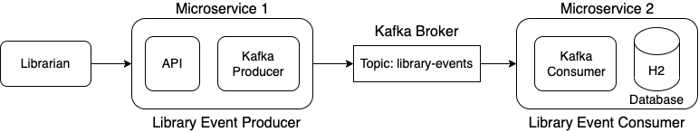

# library-kafka-springboot

## Library Event Architecture


## Microservices
### library-events-producer
`Spring Boot` application that gets invoked as soon as a book is scanned from the API and published the record to the topic `library-events`. 

### library-events-consumer
`Spring Boot` application that reads new records from the topic `library-events` and saves the payload to the in-memory h2 database.

## Prerequisites

- [`Kafka 2.13`](https://kafka.apache.org)
- [`Java 17+`](https://www.oracle.com/java/technologies/downloads/#java17)
- [`Spring Boot 3.0.1`](https://spring.io/guides/gs/spring-boot/)

## Configuration
- Start zookeeper and multiple `Kafka` brokers.

    ```
    ./zookeeper-server-start.sh ../config/zookeeper.properties
    ```
    > Modify the following properties in the **server.properties** of each broker and then start the broker.
    ```
    broker.id=<unique-broker-d>
    listeners=PLAINTEXT://localhost:<unique-port>
    log.dirs=/tmp/<unique-kafka-folder>
    auto.create.topics.enable=false
    ```
    ```
    ./kafka-server-start.sh ../config/server.properties
    ```

- Create a topic `library-events`.

    ```
    ./kafka-topics.sh --create --topic library-events --replication-factor 3 --partitions 3 --bootstrap-server localhost:9092
    ```

- Build the two projects and launch applications.

    ```
    ./gradlew build
    ```
    ```
    java -jar build/libs/library-events-producer-0.0.1-SNAPSHOT.jar
    ```
    ```
    java -jar build/libs/library-events-consumer-0.0.1-SNAPSHOT.jar
    ```

## Run the project
Open a new terminal to add or update library events
- Add a new book record.

    ```
    curl -i \
    -d '{"libraryEventId":111,"book":{"bookId":456,"bookName":"Kafka Using Spring Boot","bookAuthor":"YZ"}}' \
    -H "Content-Type: application/json" \
    -X POST http://localhost:8080/v1/libraryevent
    ```

- Update a book. 

    ```
    curl -i \
    -d '{"libraryEventId":111,"book":{"bookId":456,"bookName":"Kafka Using Spring Boot v3.0.0+","bookAuthor":"YZ"}}' \
    -H "Content-Type: application/json" \
    -X POST http://localhost:8080/v1/libraryevent
    ```

## Acknowledgement
- https://www.udemy.com/course/apache-kafka-for-developers-using-springboot